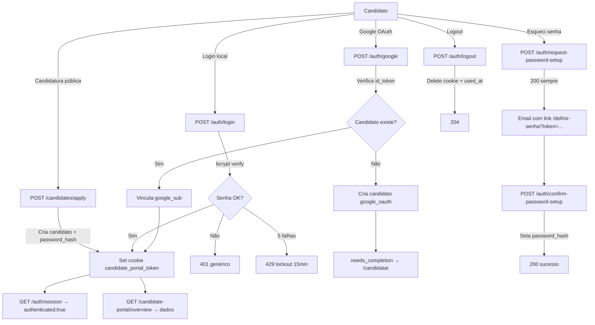

# CP-C7-AUDIT — Auditoria de Autenticação do Candidate Portal

> Data: 2026-05-31  
> Modelo: Claude Opus  
> Tipo: Auditoria read-only (nenhum código alterado)

---

## 1. Modelagem de Autenticação

### Onde ficam os dados de autenticação

Tabela `candidates` (modelo `CandidateModel`):
- `password_hash` — `String(255)`, nullable. Hash bcrypt (12 rounds) para login local.
- `password_created_at` — `TIMESTAMP`, nullable. Quando a senha foi definida.
- `last_login_at` — `TIMESTAMP`, nullable. Último login bem-sucedido.
- `google_sub` — `String(255)`, nullable, unique parcial (WHERE NOT NULL). Google Subject ID.
- `google_picture_url` — `Text`, nullable.
- `application_source` — `String(50)`, default `"manual"`. Valores: `manual`, `public_application`, `google_oauth`, `api`, `import`.

Tabela `candidate_auth_tokens`:
- `purpose` — CHECK: `'login_code'`, `'portal_session'`, `'password_setup'`
- `token_hash` — SHA-256 do token opaco (nunca raw)
- `expires_at`, `used_at`, `attempt_count`, `max_attempts`
- `ip_hash`, `user_agent_hash` — SHA-256 para auditoria

### Campos que NÃO existem
- ❌ `auth_provider` — não existe
- ❌ `provider_id` — não existe (usa `google_sub` diretamente)
- ❌ `must_change_password` — não existe
- ❌ `password_setup` flag — não existe

### Como diferencia conta Google de conta local
- Se `google_sub IS NOT NULL` → candidato tem vínculo Google
- Se `password_hash IS NOT NULL` → candidato tem senha local
- **Ambos podem coexistir** — um candidato pode ter Google + senha local
- `application_source` indica origem da criação, mas NÃO bloqueia métodos alternativos

### Como trata candidato sem senha
- Candidato criado por Google (`google_sub` set, `password_hash` null) → pode acessar via Google, não via email/senha
- Candidato criado internamente (sem `password_hash`, sem `google_sub`) → precisa usar "primeiro acesso" para definir senha
- Login com email/senha sem `password_hash` → 401 genérico ("E-mail ou senha inválidos") — sem leak

---

## 2. Login por Email/Senha

### Fluxo completo

| # | Ação | Detalhe |
|---|------|---------|
| 1 | Frontend chama | `POST /api/v1/public/auth/login` via `candidateAuthService.login(email, password)` |
| 2 | Payload | `{ email: string, password: string }` |
| 3 | Schema backend | `CandidateAuthLoginRequest`: email (EmailStr), password (8-128 chars) |
| 4 | Anti brute-force | Redis key `candidate_auth_attempts:{sha256(email)}`, máx 5, lockout 15 min |
| 5 | Busca candidato | `SELECT id, password_hash FROM candidates WHERE email = lower(email) AND NOT deleted AND NOT archived` |
| 6 | Verifica senha | `bcrypt.checkpw(password, password_hash)` |
| 7 | Sucesso | Limpa contador Redis, seta `last_login_at`, cria session token, seta cookie |
| 8 | Cookie | `candidate_portal_token`, httponly=True, samesite=lax, secure=dinâmico, max_age=24h, path=/ |

### Cenários de erro

| Cenário | Resultado | Seguro? |
|---------|-----------|---------|
| Email correto, senha correta | 200 + set-cookie | ✅ |
| Email correto, senha errada | 401 "E-mail ou senha inválidos" | ✅ Genérico |
| Email inexistente | 401 "E-mail ou senha inválidos" | ✅ Genérico |
| Candidato sem `password_hash` (Google only) | 401 "E-mail ou senha inválidos" | ✅ Genérico |
| Lockout (5+ tentativas) | 429 | ✅ Distinto de 401 |
| Senha < 8 ou > 128 chars | 422 (Pydantic) | ✅ |

### 401 atual é esperado ou bug?
**Esperado.** O 401 em `POST /auth/login` ocorre quando credenciais são inválidas, candidato não existe, ou candidato não tem `password_hash`. Não é bug.

---

## 3. Login por Google

### Fluxo completo

| # | Ação | Detalhe |
|---|------|---------|
| 1 | Frontend (NÃO implementado) | Não existe integração Google no frontend do candidate-portal |
| 2 | Endpoint backend | `POST /api/v1/public/auth/google` com `{ id_token: string }` |
| 3 | Verificação | Chama `https://oauth2.googleapis.com/tokeninfo` com o token |
| 4 | Validações | `aud` == GOOGLE_CLIENT_ID, `iss` == accounts.google.com, `email_verified` == true |
| 5 | Busca/cria candidato | Busca por `google_sub`, depois por email |
| 6 | Conflito | Se `google_sub` bate com candidato A e email bate com candidato B → 409 |
| 7 | Novo candidato | Cria com `application_source="google_oauth"`, perfil incompleto |
| 8 | Candidato existente | Atualiza `google_sub` e `google_picture_url` |
| 9 | Session | Cria via `CandidatePortalAuthService.create_session` + seta cookie |
| 10 | Resposta | `"authenticated"` (perfil completo) ou `"needs_completion"` (perfil incompleto) |

### ⚠️ ACHADO CRÍTICO: Frontend Google NÃO existe
- O backend tem endpoint `/auth/google` completo e testado
- **O frontend do candidate-portal NÃO tem botão Google, lib Google Sign-In, ou qualquer referência a OAuth**
- Zero ocorrências de "google", "Google", "oauth", "OAuth" no frontend
- O login Google é **backend-only** — funciona se chamado diretamente, mas nenhum candidato consegue usá-lo pelo portal

### Riscos de duplicidade
- **Bem tratados no backend**: busca por `google_sub` E email, detecta conflitos
- **Risco real**: como o frontend não tem Google, candidatos que criam conta por candidatura e depois tentam Google (quando for implementado) terão vínculo correto por email

---

## 4. Request Password Setup

### Fluxo

| # | Ação | Detalhe |
|---|------|---------|
| 1 | Endpoint | `POST /api/v1/public/auth/request-password-setup` (rota delegada) |
| 2 | Payload | `{ email: string }` (EmailStr) |
| 3 | Propósito | Primeiro acesso E recuperação de senha (mesmo endpoint) |
| 4 | Busca candidato | Por email, ativo (não deletado/arquivado) |
| 5 | Candidato encontrado | Invalida tokens anteriores, cria novo (2h TTL), envia email |
| 6 | Candidato NÃO encontrado | Retorna 200 genérico (anti-enumeração) |
| 7 | Resposta | **SEMPRE** 200: "Se houver um cadastro com este e-mail, enviaremos as instruções de acesso." |

### Cenários de erro

| Cenário | Resultado |
|---------|-----------|
| Email existe | 200 + email enviado com link `/definir-senha?token=...` |
| Email não existe | 200 (sem email) — anti-enumeração ✅ |
| Email inválido / vazio / blank | 422 (Pydantic) |
| Candidato Google-only | 200 + email enviado — candidato **pode** definir senha local ✅ |
| Falha SMTP (config) | 200 + log warning (não 500) ✅ |
| Falha SMTP (delivery) | 200 + log warning (não 500) ✅ |
| Exceção inesperada no email | 200 + log warning (não 500) ✅ |
| Exceção na fase DB | **500** "Não foi possível processar a solicitação." |

### O 500 observado pode acontecer?
**Sim**, mas apenas na fase 1 (DB). Se a query falhar (ex: DB down, constraint violation), o handler faz rollback e retorna 500. A fase 2 (email) é non-fatal. **Isso é correto** — um 500 na fase DB é um erro real do servidor.

---

## 5. Confirm Password Setup

### Fluxo

| # | Ação | Detalhe |
|---|------|---------|
| 1 | Endpoint | `POST /api/v1/public/auth/confirm-password-setup` |
| 2 | Payload | `{ token: string (20-256 chars), password: string (8-128 chars) }` |
| 3 | Validação do token | SHA-256 → busca na DB → verifica not used, not expired, candidato ativo |
| 4 | Token válido | Seta `password_hash = bcrypt(password)`, `password_created_at = now()`, marca token como usado |
| 5 | Token inválido/expirado | 400 "Link inválido ou expirado." |
| 6 | Candidato Google | **Funciona normalmente** — define senha local, candidato fica com ambos os métodos |
| 7 | Após definir senha | Login local funciona imediatamente |

### ⚠️ ACHADO: Token single-use mas SEM teste explícito de reuso
- O campo `used_at` é setado ao confirmar → token vira single-use
- Mas **não há teste explícito** que tente reusar um token consumido (gap de teste)

---

## 6. Sessão / Cookie

### Configuração

| Atributo | Valor |
|----------|-------|
| Nome | `candidate_portal_token` |
| HttpOnly | `True` ✅ |
| SameSite | `"lax"` ✅ |
| Secure | Dinâmico: `request.url.scheme == "https"` |
| Path | `/` |
| Max-Age | 86400 (24h) |
| Domain | Não setado (default do navegador) |

### Comportamento

| Cenário | Resultado |
|---------|-----------|
| Logout | `response.delete_cookie("candidate_portal_token", path="/")` + marca session `used_at` na DB |
| Logout sem session | 204 (idempotente) |
| `/auth/session` sem cookie | 200 `{ authenticated: false, candidate_name: null }` ✅ |
| `/candidate-portal/overview` sem cookie | 401 "Sessão do candidato inválida ou expirada" |
| App.tsx usa qual endpoint? | `GET /auth/session` (nunca 401, sem erro no console) ✅ |
| Erro 401 em páginas públicas? | **NÃO** — `GET /auth/session` sempre retorna 200 ✅ |

### ⚠️ ACHADOS de sessão
1. **Secure=False em dev** — esperado, mas se o proxy de produção não for HTTPS, cookie vai trafegar sem criptografia
2. **Sem rotação de token** — o mesmo token é usado por 24h inteiras; não há rotação após uso
3. **Sessões anteriores NÃO são invalidadas** em login ou password reset — candidato pode ter N sessões ativas simultâneas
4. **Logout invalida apenas a sessão atual** — sessões em outros dispositivos permanecem ativas

---

## 7. Frontend UX

### Tela de login

| Item | Estado |
|------|--------|
| Mostra Google e email/senha? | **NÃO** — apenas email/senha. Sem botão Google. |
| Mensagem para 401 | "E-mail ou senha inválidos. Verifique seus dados." — ✅ Clara |
| Mensagem para Google → senha local | N/A (não existe Google no frontend) |
| Fluxo "esqueci senha / criar acesso" | Toggle na tela de login, abre com `?firstAccess=1` — ✅ |
| Link de política em nova aba | ✅ `target="_blank" rel="noopener noreferrer"` |
| Botão de visualizar senha | ✅ Eye/EyeOff toggle |
| Erros assustam candidato? | Não — mensagens genéricas e profissionais ✅ |

### ⚠️ ACHADOS de UX
1. **Login ignora `redirect_to`** do backend — sempre vai para `/minha-area`
2. **Login ignora `session_expires_at`** — não implementa timeout warning
3. **Sem route guard global** — cada página autenticada trata 401 individualmente (5+ locais com lógica repetida)
4. **Tela de login NÃO mostra mensagem para candidato Google** — se candidato criou conta por Google API mas não tem senha local, o 401 genérico não ajuda

---

## 8. Testes Existentes

### Cobertura

| Área | Arquivo(s) | Cenários |
|------|-----------|----------|
| Login local | `test_candidate_portal_and_public_analysis.py` | ✅ Credenciais inválidas, válidas, candidato inexistente, set-cookie, data isolation |
| Logout | `test_candidate_portal_logout.py` | ✅ Idempotente, cookie cleared |
| Password setup request | `test_candidate_portal_and_public_analysis.py` | ✅ Anti-enumeração, token creation, email delivery, SMTP failure, invalid payload |
| Password setup confirm | `test_candidate_portal_and_public_analysis.py` | ✅ Full flow, invalid token, expired token |
| Google OAuth | `test_candidate_google_auth.py` | ✅ 8 cenários: invalid token, unverified email, new candidate, existing candidate, email linking, conflict, missing config |
| Brute-force | `test_security_auth_lockout.py` | ✅ Lockout after N attempts, success clears counter, 429 vs 401 |
| Rate limiting | `test_rate_limiting.py` | ✅ Login 5/min, apply 10/min |
| Session enforcement | `test_candidate_portal_session_audit.py` | ✅ AST analysis ensures all routes use `CurrentCompleteCandidateSession` |
| No internal leak | `test_r14_candidate_portal_no_internal_leak.py` | ✅ password_hash, internal_notes, CPF nunca expostos |
| User/candidate boundary | `test_user_candidate_boundary.py` | ✅ Candidate creation != User creation |
| E2E | `alice-candidate-portal.spec.ts`, `smoke-c5.spec.ts` | ✅ Playwright full flow |
| API contract | `test_public_api_contract.py` | ✅ Auth aliases, session required, ownership |

### Lacunas de teste

| Gap | Risco |
|-----|-------|
| Token de password_setup reusado | Médio — implementação parece correta (marca `used_at`), mas sem teste |
| Sessões anteriores após password reset | Médio — sessões antigas permanecem válidas após troca de senha |
| Sessões concorrentes | Baixo — funciona, mas sem teste explícito |
| Cookie attributes (HttpOnly, Secure, SameSite) | Baixo — sem teste que valide headers do set-cookie |
| Email case sensitivity no login | Baixo — código usa `lower()`, mas sem teste de "User@Email.COM" |
| Candidate deactivation + login | Médio — sem teste que desativa candidato e verifica que login falha |
| Frontend auth state | Alto — zero testes unitários de frontend para hooks/guards de auth |
| Google + senha coexistência | Médio — sem teste de candidato que tem ambos os métodos |

---

## 9. Riscos e Problemas Consolidados

### 🔴 MUST-FIX (antes de produção)

| # | Problema | Detalhe |
|---|----------|---------|
| 1 | **Frontend Google inexistente** | Backend suporta Google OAuth, mas o frontend não tem nenhuma integração. Se candidatos foram criados por Google (via API/admin), eles **não conseguem logar** pelo portal. |
| 2 | **Sessões não invalidadas em password reset** | Ao trocar senha, sessões anteriores permanecem válidas por até 24h. Risco de segurança se a senha foi comprometida. |

### 🟡 SHOULD-FIX (alta prioridade)

| # | Problema | Detalhe |
|---|----------|---------|
| 3 | **Sem CSRF protection visível** | Nenhum header CSRF no frontend. SameSite=lax mitiga parcialmente, mas POST de outros sites com link simples pode funcionar em navegadores antigos. |
| 4 | **Auth guard repetido em 5+ locais** | Cada página trata 401 individualmente. Risco de nova página esquecer o guard. Proposta: interceptor global ou route wrapper. |
| 5 | **Login ignora redirect_to e session_expires_at** | Backend envia dados úteis que o frontend descarta. |
| 6 | **Candidato Google sem mensagem de orientação** | Se candidato foi criado por Google (API/admin) e tenta login local sem senha, recebe 401 genérico sem saber que precisa criar senha primeiro. |

### 🟢 COULD-IMPROVE (baixa prioridade)

| # | Melhoria | Detalhe |
|---|----------|---------|
| 7 | Session token rotation | Após cada request autenticado, rotacionar token para reduzir janela de exposição. |
| 8 | Password complexity | Apenas min=8, sem upper/number/special. Considerar zxcvbn ou requisitos mínimos adicionais. |
| 9 | Password setup token em URL | Token viaja como query param — pode aparecer em server logs, referrer headers, browser history. Considerar POST-only flow. |
| 10 | Session timeout warning no frontend | Backend envia `session_expires_at`, frontend poderia alertar antes de expirar. |
| 11 | Email case insensitivity teste | Código usa `lower()` mas sem teste explícito. |

---

## 10. Diagrama de Fluxo da Autenticação

---

## 11. Próximas Fases Sugeridas

### CP-C8A — Implementar Google Login no Frontend
- Adicionar botão Google Sign-In na tela de login
- Instalar/configurar Google Identity Services (GIS) lib
- Enviar `id_token` para `POST /auth/google`
- Tratar respostas `authenticated` e `needs_completion`

### CP-C8B — Invalidar Sessões em Password Reset
- Em `confirm_password_setup`, marcar todas as sessões `portal_session` do candidato como `used_at`
- Adicionar teste de regressão

### CP-C8C — Auth Guard Global no Frontend
- Criar `RequireAuth` route wrapper ou interceptor global em `publicApiClient`
- Remover lógica repetida de 401 nas 5+ páginas
- Adicionar teste de frontend

### CP-C8D — CSRF Protection
- Avaliar se SameSite=lax é suficiente para o perfil de risco
- Se não, implementar CSRF token (double-submit cookie ou header sincronizado)

---

## 12. Confirmações Explícitas

- [x] Não alterei código nesta fase.
- [x] Não criei endpoint novo.
- [x] Não alterei backend.
- [x] Não alterei frontend.
- [x] Não alterei staff/admin.
- [x] Não alterei Pipeline.
- [x] Não alterei RBAC.
- [x] Não alterei regra de candidatura.
- [x] Não criei mock falso.
- [x] Não inventei dados.
- [x] Não fiz commit.
- [x] Não fiz deploy.
