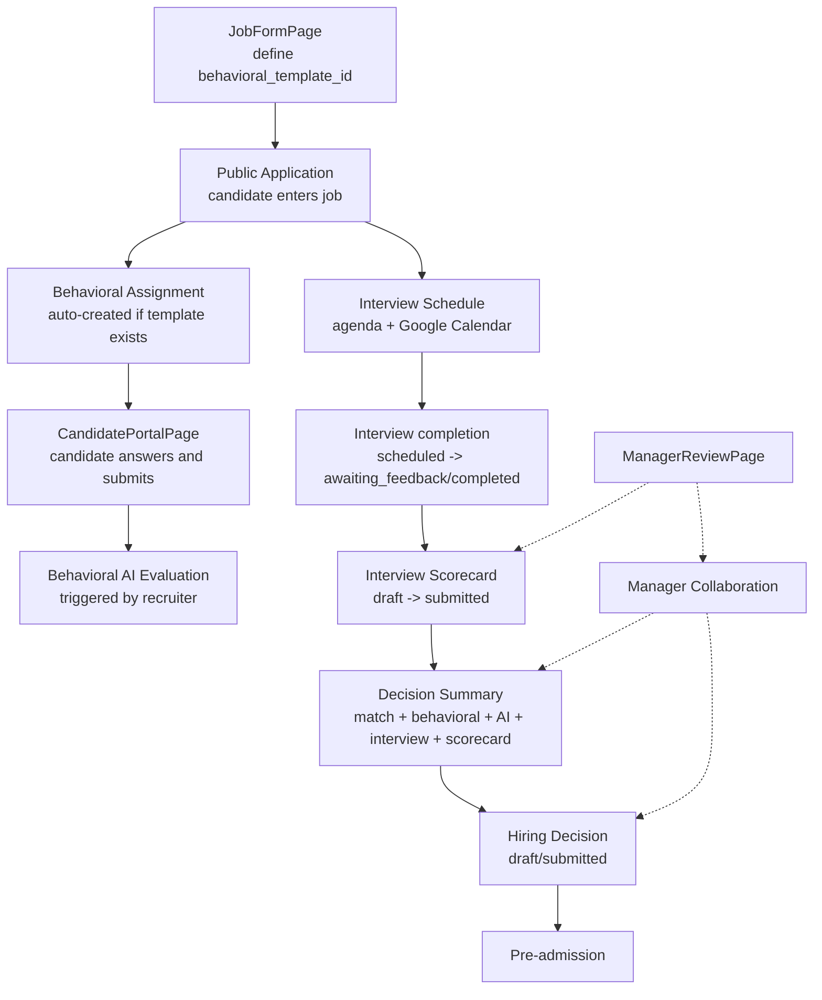

# FASE 25A — Auditoria do Fluxo de Avaliações

## Escopo

Auditoria estática e funcional do fluxo de avaliações do `resume-ai-system`, sem alterar código, schema, API ou regra de negócio.

Módulos auditados:

1. Behavioral Templates
2. Behavioral Assignments
3. Behavioral Answers
4. Behavioral AI Evaluation
5. Interview Schedules
6. Interview Scorecards
7. Interview Scorecard Items
8. Manager Collaboration
9. Decision Summary
10. Hiring Decisions
11. CandidateDrawer
12. ManagerReviewPage
13. CandidatePortalPage
14. JobFormPage

## Resumo Executivo

O sistema já tem a maior parte da fundação técnica de avaliações, mas o fluxo está fragmentado em quatro superfícies:

- configuração na vaga;
- resposta do candidato no portal;
- leitura e operação do recrutador no `CandidateDrawer`;
- visão reduzida do gestor em `ManagerReviewPage`.

O principal problema hoje não é ausência total de backend. O problema é conexão de produto:

- o template comportamental nasce na vaga, mas a vaga não deixa claro quando ele é obrigatório;
- o assignment é criado só no fluxo de candidatura pública;
- o candidato consegue responder e submeter, mas não recebe UX forte de prazo, pendência e obrigatoriedade;
- a IA comportamental existe e está guard-railed, mas aparece só no drawer do recrutador;
- entrevista existe e está operacional;
- scorecard existe, mas não está encaixado num fluxo claro de gestor;
- colaboração existe, mas é paralela ao scorecard;
- decision summary existe, mas só consolida para o recrutador;
- hiring decision existe, mas suas exigências são parcialmente hardcoded e não configuráveis por vaga.

Diagnóstico objetivo:

- `Interview Schedules` é o módulo mais maduro e operacional.
- `Behavioral Assessment` existe end-to-end, mas está subutilizado e parcialmente conectado.
- `Scorecards`, `Manager Review`, `Decision Summary` e `Hiring Decision` existem, mas ainda não formam um fluxo único de structured hiring.

## Evidência de uso real no banco local

Snapshot do banco local auditado:

- `behavioral_assessment_templates`: 1
- `behavioral_template_competencies`: 0
- `behavioral_template_questions`: 0
- `jobs` com `behavioral_template_id`: 0
- `behavioral_assessment_assignments`: 0
- `behavioral_assessment_answers`: 0
- `behavioral_assessment_ai_evaluations`: 0
- `interview_schedules`: 228
- `interview_scorecards`: 0
- `interview_scorecard_items`: 0
- `candidate_job_collaboration_comments`: 0
- `candidate_job_hiring_decisions`: 1

Leitura disso:

- entrevistas já têm uso real;
- a malha de avaliação comportamental está implementada, mas não está operacional no banco local atual;
- scorecard, colaboração e decisão final existem, mas ainda não aparecem como fluxo cotidiano.

## Mapa Técnico dos Módulos

### 1. Behavioral Templates

- Tabela/model: `behavioral_assessment_templates`, `behavioral_template_competencies`, `behavioral_template_questions`
- Modelos: `backend/src/infrastructure/database/models/behavioral_template_model.py`
- Service: `backend/src/application/services/behavioral_template_service.py`
- Repository: `backend/src/infrastructure/repositories/sqlalchemy_behavioral_template_repository.py`
- Router/endpoints: `backend/src/interface/api/routers/behavioral_templates.py`
- Frontend service: `frontend/src/services/behavioralTemplatesService.ts`
- Tela/componente:
  - `frontend/src/pages/BehavioralTemplatesPage.tsx`
  - `frontend/src/features/jobs/components/BehavioralTemplateSelector.tsx`
  - `frontend/src/pages/JobFormPage.tsx`
- Testes:
  - `backend/tests/integration/test_behavioral_templates.py`
  - `frontend/src/pages/__tests__/BehavioralTemplatesPage.test.tsx`
  - `frontend/src/features/jobs/__tests__/jobFormConfig.test.ts`
- Status: `parcial`

Observações:

- Backend suporta template, competency e question CRUD.
- A tela `BehavioralTemplatesPage` hoje opera só em nível de template, ativação e arquivamento.
- A UI não expõe CRUD completo de competências e perguntas, apesar dos endpoints existirem.

### 2. Behavioral Assignments

- Tabela/model: `behavioral_assessment_assignments`
- Modelo: `backend/src/infrastructure/database/models/behavioral_assignment_model.py`
- Service: `backend/src/application/services/behavioral_assignment_service.py`
- Repository: `backend/src/infrastructure/repositories/sqlalchemy_behavioral_assignment_repository.py`
- Router/endpoints:
  - candidato: `backend/src/interface/api/routers/candidate_behavioral_assessments.py`
  - recrutador: `backend/src/interface/api/routers/jobs.py`
- Frontend service:
  - recrutador: `frontend/src/services/behavioralAssessmentService.ts`
  - candidato: `frontend/src/services/candidatePortalService.ts`
- Tela/componente:
  - `frontend/src/pages/CandidatePortalPage.tsx`
  - `frontend/src/features/candidates/drawer/components/CandidateBehavioralAssessmentPanel.tsx`
- Testes:
  - `backend/tests/integration/test_behavioral_assignments.py`
  - `backend/tests/e2e/test_demo_full_flow.py`
  - `backend/tests/e2e/test_full_ats_flow.py`
  - `frontend/src/pages/__tests__/CandidatePortalFlow.test.tsx`
  - `frontend/src/features/candidates/drawer/components/__tests__/CandidateBehavioralAssessmentPanel.test.tsx`
- Status: `parcial`

Observações:

- O assignment é criado por `ensure_assignment_for_application(...)`.
- Hoje ele só está claramente conectado ao fluxo de candidatura pública em `public_application_service.py`.
- Não há evidência de criação automática equivalente ao adicionar candidato manualmente à vaga.

### 3. Behavioral Answers

- Tabela/model: `behavioral_assessment_answers`
- Modelo: `backend/src/infrastructure/database/models/behavioral_assignment_model.py`
- Service: `backend/src/application/services/behavioral_assignment_service.py`
- Repository: `backend/src/infrastructure/repositories/sqlalchemy_behavioral_assignment_repository.py`
- Router/endpoints: `backend/src/interface/api/routers/candidate_behavioral_assessments.py`
- Frontend service: `frontend/src/services/candidatePortalService.ts`
- Tela/componente:
  - `frontend/src/features/candidate-portal/components/BehavioralAssessmentForm.tsx`
  - `frontend/src/pages/CandidatePortalPage.tsx`
- Testes:
  - `backend/tests/integration/test_behavioral_assignments.py`
  - `frontend/src/pages/__tests__/CandidatePortalFlow.test.tsx`
- Status: `completo` no CRUD básico, `parcial` no produto

Observações:

- Há rascunho via `PUT /answers`.
- Há submissão via `POST /submit`.
- Depois de `submitted`, edição é bloqueada no backend e no frontend.
- Falta UX explícita de prazo, SLA e pendência.

### 4. Behavioral AI Evaluation

- Tabela/model: `behavioral_assessment_ai_evaluations`
- Modelo: `backend/src/infrastructure/database/models/behavioral_assignment_model.py`
- Service: `backend/src/application/services/behavioral_ai_evaluation_service.py`
- Repository: `backend/src/infrastructure/repositories/sqlalchemy_behavioral_assignment_ai_repository.py`
- Router/endpoints: `backend/src/interface/api/routers/jobs.py`
- Frontend service: `frontend/src/services/behavioralAIEvaluationService.ts`
- Tela/componente:
  - `frontend/src/features/candidates/drawer/components/BehavioralAIEvaluationPanel.tsx`
  - embutido em `CandidateBehavioralAssessmentPanel`
- Testes:
  - `frontend/src/features/candidates/drawer/components/__tests__/BehavioralAIEvaluationPanel.test.tsx`
  - cobertura indireta em `backend/tests/integration/test_decision_summary.py`
- Status: `parcial`

Observações:

- Só roda para assignment `submitted`.
- Usa `AIServiceFactory.create(settings.AI_PROVIDER, settings.AI_MODEL_ID)`.
- No ambiente atual, `AI_MODEL_ID` default está em Gemini e o service já impõe guardrails fortes:
  - não aprova/reprova;
  - não move pipeline;
  - não altera score/ranking;
  - bloqueia linguagem clínica/diagnóstica.
- Ainda está acoplado ao drawer do recrutador; não existe camada central de revisão.

### 5. Interview Schedules

- Tabela/model: `interview_schedules`
- Modelo: `backend/src/infrastructure/database/models/interview_schedule_model.py`
- Service: `backend/src/application/services/interview_schedule_service.py`
- Repository: `backend/src/infrastructure/repositories/sqlalchemy_interview_schedule_repository.py`
- Router/endpoints: `backend/src/interface/api/routers/interview_schedules.py`
- Frontend service: `frontend/src/services/agendaService.ts`
- Tela/componente:
  - `frontend/src/features/candidates/drawer/tabs/InterviewTab.tsx`
  - `frontend/src/pages/AgendaPage.tsx`
  - `frontend/src/pages/CandidatePortalPage.tsx` mostra apenas o lado público da entrevista
- Testes:
  - `backend/tests/integration/test_interview_operational_flow.py`
  - `frontend/src/features/candidates/drawer/tabs/__tests__/InterviewTab.test.tsx`
- Status: `completo`

Observações:

- É o módulo mais consistente hoje.
- Conecta candidato, vaga e pipeline.
- Suporta Google Calendar/Meet.
- Status válidos:
  - `scheduled`
  - `completed`
  - `cancelled`
  - `rescheduled`
  - `no_show`
  - `awaiting_feedback`

### 6. Interview Scorecards

- Tabela/model: `interview_scorecards`
- Modelo: `backend/src/infrastructure/database/models/interview_scorecard_model.py`
- Service: `backend/src/application/services/interview_scorecard_service.py`
- Repository: `backend/src/infrastructure/repositories/sqlalchemy_interview_scorecard_repository.py`
- Router/endpoints: `backend/src/interface/api/routers/interview_scorecards.py`
- Frontend service: `frontend/src/services/interviewScorecardService.ts`
- Tela/componente:
  - `frontend/src/features/candidates/drawer/components/InterviewScorecardPanel.tsx`
  - `frontend/src/features/candidates/drawer/components/InterviewScorecardForm.tsx`
  - `frontend/src/features/candidates/drawer/tabs/InterviewTab.tsx`
- Testes:
  - `backend/tests/integration/test_interview_scorecards.py`
  - `backend/tests/integration/test_interview_operational_flow.py`
  - `frontend/src/features/candidates/drawer/components/__tests__/InterviewScorecardPanel.test.tsx`
- Status: `parcial`

Observações:

- O scorecard está funcional.
- Fica `draft` até submit.
- Depois de `submitted`, vira read-only.
- Falta posicionamento claro de quem deve preencher em cada tipo de entrevista.

### 7. Interview Scorecard Items

- Tabela/model: `interview_scorecard_items`
- Modelo: `backend/src/infrastructure/database/models/interview_scorecard_model.py`
- Service: acoplado a `InterviewScorecardService`
- Repository: acoplado a `SQLAlchemyInterviewScorecardRepository`
- Router/endpoints: mesmos do scorecard
- Frontend service: mesmos do scorecard
- Tela/componente:
  - `frontend/src/features/candidates/drawer/components/InterviewScorecardItem.tsx`
  - `frontend/src/features/candidates/drawer/components/InterviewScorecardForm.tsx`
- Testes:
  - cobertura em `InterviewScorecardPanel.test.tsx`
- Status: `parcial`

Observações:

- O item existe, mas o kit é genérico.
- Quando não existe scorecard, o frontend cria critérios default:
  - `Competência técnica`
  - `Comunicação`
  - `Colaboração`
- Não existe kit por tipo de vaga, por tipo de entrevista ou por senioridade.

### 8. Manager Collaboration

- Tabela/model: `candidate_job_collaboration_comments`
- Modelo: `backend/src/infrastructure/database/models/collaboration_comments_model.py`
- Service: `backend/src/application/services/collaboration_service.py`
- Repository: não há repository dedicado; acesso direto via service/session
- Router/endpoints: `backend/src/interface/api/routers/collaboration.py`
- Frontend service: `frontend/src/services/collaborationService.ts`
- Tela/componente:
  - recrutador: `frontend/src/features/candidates/drawer/components/CollaborationTab.tsx`
  - gestor: backend endpoint existe, mas `ManagerReviewPage` não integra esse fluxo
- Testes:
  - `backend/tests/integration/test_collaboration_service.py`
  - `frontend/src/features/candidates/drawer/components/__tests__/CollaborationTab.test.tsx`
- Status: `parcial`

Observações:

- Comentário e feedback do gestor existem.
- Não movem pipeline por si só, o que está correto.
- O fluxo do gestor não leva naturalmente até esse ponto.

### 9. Decision Summary

- Agregação lógica, sem tabela própria
- Service: `backend/src/application/services/decision_summary_service.py`
- Repository: `backend/src/infrastructure/repositories/sqlalchemy_decision_summary_repository.py`
- Router/endpoints: `backend/src/interface/api/routers/decision_summary.py`
- Frontend service: `frontend/src/services/decisionSummaryService.ts`
- Tela/componente:
  - `frontend/src/features/candidates/drawer/components/CandidateFinalDecisionSummaryCard.tsx`
  - `frontend/src/features/candidates/drawer/tabs/OverviewTab.tsx`
- Testes:
  - `backend/tests/integration/test_decision_summary.py`
  - `frontend/src/features/candidates/drawer/components/__tests__/CandidateFinalDecisionSummaryCard.test.tsx`
- Status: `parcial`

Observações:

- Consolida:
  - match atual da vaga;
  - assessment comportamental;
  - IA comportamental;
  - entrevista;
  - scorecard.
- Ainda não consolida colaboração do gestor.
- Existe para o recrutador, não para o gestor e nunca para o candidato.

### 10. Hiring Decisions

- Tabela/model: `candidate_job_hiring_decisions`
- Modelo: `backend/src/infrastructure/database/models/hiring_decision_model.py`
- Service: `backend/src/application/services/hiring_decision_service.py`
- Repository: `backend/src/infrastructure/repositories/sqlalchemy_hiring_decision_repository.py`
- Router/endpoints: `backend/src/interface/api/routers/hiring_decisions.py`
- Frontend service: `frontend/src/services/hiringDecisionService.ts`
- Tela/componente:
  - `frontend/src/features/candidates/drawer/components/CandidateHiringDecisionPanel.tsx`
- Testes:
  - `backend/tests/integration/test_hiring_decisions.py`
  - `frontend/src/features/candidates/drawer/components/__tests__/CandidateHiringDecisionPanel.test.tsx`
- Status: `parcial`

Observações:

- É auditável e versionado.
- Pode disparar ação opcional de pipeline.
- Regra atual relevante:
  - `hire` exige `notes`;
  - `hire` exige scorecard `submitted`, exceto `reason_code=other`.
- A obrigatoriedade de assessment/gestor não é configurável por vaga.

### 11. CandidateDrawer

- Tela central do recrutador: `frontend/src/features/pipeline/CandidateDrawer.tsx`
- Usa componentes:
  - `CandidateBehavioralAssessmentPanel`
  - `InterviewTab`
  - `InterviewScorecardPanel`
  - `CollaborationTab`
  - `CandidateFinalDecisionSummaryCard`
  - `CandidateHiringDecisionPanel`
- Testes:
  - `frontend/src/features/pipeline/__tests__/CandidateDrawer.test.tsx`
  - testes específicos dos componentes
- Status: `parcial`

Observações:

- É o hub real de avaliações do recrutador.
- Hoje mistura leitura, operação e decisão em um mesmo drawer.

### 12. ManagerReviewPage

- Página: `frontend/src/features/manager/ManagerReviewPage.tsx`
- Backend service: `backend/src/application/services/manager_view_service.py`
- Repository: sem repository dedicado; query direta no service
- Router/endpoints: `backend/src/interface/api/routers/manager.py`
- Frontend service: `frontend/src/services/managerService.ts`
- Testes:
  - `backend/tests/integration/test_manager_endpoints.py`
  - `frontend/src/features/manager/__tests__/ManagerReviewPage.test.tsx`
- Status: `parcial`

Observações:

- É read-only.
- Mostra vagas, candidatos e um resumo seguro do scorecard.
- Não expõe entrevista, assessment, colaboração nem preenchimento de avaliação.

### 13. CandidatePortalPage

- Página: `frontend/src/pages/CandidatePortalPage.tsx`
- Backend service: `backend/src/application/services/candidate_portal_service.py`
- Routers/endpoints:
  - portal público: `/api/v1/public/candidate-portal/*`
  - assessment do candidato: `/api/v1/candidate-portal/behavioral-assessments/*`
- Frontend service: `frontend/src/services/candidatePortalService.ts`
- Componentes:
  - `BehavioralAssessmentCard`
  - `BehavioralAssessmentForm`
  - `CandidatePortalPreAdmissionCard`
- Testes:
  - `frontend/src/pages/__tests__/CandidatePortalFlow.test.tsx`
- Status: `parcial`

Observações:

- É o único ponto onde o candidato de fato responde assessment.
- O portal comunica bem a existência da avaliação, mas não oferece regime forte de prazo, prioridade ou impacto no processo.

### 14. JobFormPage

- Página: `frontend/src/pages/JobFormPage.tsx`
- Tipos/payload: `frontend/src/features/jobs/jobFormConfig.ts`
- Helper: `frontend/src/features/jobs/utils/jobFormHelpers.ts`
- Selector: `frontend/src/features/jobs/components/BehavioralTemplateSelector.tsx`
- Backend field: `jobs.behavioral_template_id`
- Testes:
  - `frontend/src/features/jobs/__tests__/jobFormConfig.test.ts`
- Status: `parcial`

Observações:

- A vaga pode ter ou não template.
- Isso está tecnicamente suportado.
- O formulário não deixa explícito:
  - se a avaliação é obrigatória;
  - em que etapa ela entra;
  - o que trava ou não trava a decisão final.

## Fluxo Atual por Etapa

### 1. Criação da vaga

- O template comportamental é vinculado por `jobs.behavioral_template_id`.
- O `JobFormPage` tem etapa `behavioral` com `BehavioralTemplateSelector`.
- A vaga pode exigir avaliação se tiver template vinculado.
- A vaga pode não exigir avaliação se `behavioral_template_id = null`.
- O ponto fraco é de UX e governança, não de schema.

### 2. Candidatura

- O `behavioral assignment` é criado em `public_application_service.py` quando a candidatura pública entra na vaga.
- Não há evidência equivalente no fluxo manual interno.
- O candidato vê a avaliação no `CandidatePortalPage`, aba `Avaliações`.
- O candidato entende que precisa responder, mas sem peso de obrigatoriedade muito claro.
- Existe `status`; existe `expires_at` na tabela; não existe UX madura de prazo.

### 3. Resposta do candidato

- Respostas são salvas em `behavioral_assessment_answers`.
- Existe rascunho.
- Existe submit.
- Após `submitted`, backend bloqueia edição e o frontend fica read-only.

### 4. IA comportamental

- É gerada sob demanda pelo recrutador.
- Usa o provider configurado em `AIServiceFactory`; no ambiente atual está em Gemini por default.
- É testável e mockável via abstração de `AIService`.
- Retorna resumo, sinais por competência, forças, preocupações, perguntas sugeridas.
- Não pode aprovar/reprovar, mudar score, mover pipeline nem emitir linguagem clínica.

### 5. Entrevista

- Entrevista se liga a `candidate_id`, `job_id` e opcionalmente `pipeline_id`.
- Se liga ao Google Calendar por `InterviewCalendarSyncService`.
- Fluxo de status:
  - criação: `scheduled`
  - remarcação: `rescheduled`
  - conclusão sem scorecard: `awaiting_feedback`
  - conclusão com scorecard submetido: `completed`
  - ausência: `no_show`
  - cancelamento: `cancelled`

### 6. Scorecard

- Scorecard se liga à entrevista por `interview_id`.
- Também pode existir scorecard sem entrevista associada.
- Quem preenche hoje: recrutador ou admin; manager não tem tela própria de preenchimento.
- Campos:
  - recommendation final
  - notes
  - items com `competency_name`, `question_text`, `rating`, `evidence`, `weight`, `display_order`
- `submitted` fica read-only.

### 7. Gestor

- O gestor entra hoje via `ManagerReviewPage`, mas só vê resumo seguro.
- Feedback do gestor existe via `collaboration` endpoint.
- Isso é opcional hoje.
- Feedback do gestor não move pipeline automaticamente e deve continuar assim.

### 8. Decision Summary

- Consolida match, assessment, IA, entrevista e scorecard.
- Aparece no drawer do recrutador.
- Não aparece como fluxo central do gestor.
- Não deve aparecer para o candidato.

### 9. Decisão final

- `hire` hoje exige scorecard submetido, salvo exceção com `reason_code=other`.
- Assessment comportamental não é obrigatoriedade configurável; ele entra indiretamente pela lógica do summary.
- Gestor não é obrigatório por configuração.
- O ideal é que isso dependa da configuração da vaga, o que ainda não existe.

## Lacunas

- Falta uma tela central de avaliações para recrutador.
- Falta uma tela operacional de avaliação para gestor.
- Falta configurar obrigatoriedade por vaga:
  - assessment comportamental obrigatório ou opcional;
  - scorecard obrigatório ou opcional;
  - gestor obrigatório ou opcional.
- Falta prazo e SLA explícitos para assessment.
- Falta kit estruturado de entrevista por tipo de vaga.
- Falta scorecard baseado em interview kit.
- Falta decisão final baseada em gates configuráveis e não hardcoded.
- Falta visibilidade de pendências do fluxo para recrutador.
- Falta UX de pendência/urgência no portal do candidato.

## Comparação com ATS moderno

O desenho ideal de ATS moderno normalmente inclui:

- structured hiring por vaga;
- interview kits por etapa;
- scorecards padronizados por entrevistador;
- critérios obrigatórios por vaga;
- consolidado final de sinais;
- trilha auditável de decisão humana.

Estado atual do projeto:

- `structured hiring`: parcial
- `interview kits`: ausente
- `scorecards`: presente, mas genérico
- `critérios por vaga`: parcial
- `feedback padronizado`: parcial
- `decision summary`: presente
- `auditoria`: presente na decisão final

## Matriz

| Módulo | Está implementado? | Está conectado? | Onde aparece? | Problema | Próxima ação | Prioridade |
|---|---|---|---|---|---|---|
| Behavioral Templates | Sim | Parcial | Admin templates, JobForm | UI não gerencia competências/perguntas | Fechar editor completo de template | Alta |
| Behavioral Assignments | Sim | Parcial | CandidatePortal, Drawer | Só nasce claramente no fluxo público | Criar regra única de criação por candidatura/vínculo | Alta |
| Behavioral Answers | Sim | Sim | CandidatePortal | Falta prazo e UX de pendência | Adicionar SLA/status de pendência | Média |
| Behavioral AI Evaluation | Sim | Parcial | Drawer | Restrita ao recrutador, sem camada central | Integrar ao fluxo oficial de avaliação | Alta |
| Interview Schedules | Sim | Sim | Agenda, Drawer, Portal | Falta conexão semântica forte com scorecard | Amarrar entrevista + scorecard por etapa | Média |
| Interview Scorecards | Sim | Parcial | Drawer | Sem fluxo claro para gestor e sem kit por vaga | Definir autoria e obrigatoriedade por etapa | Alta |
| Interview Scorecard Items | Sim | Parcial | Drawer | Critérios default genéricos | Criar interview kits estruturados | Alta |
| Manager Collaboration | Sim | Parcial | Drawer | Gestor não tem jornada natural até aqui | Integrar com tela de revisão do gestor | Alta |
| Decision Summary | Sim | Parcial | Drawer | Consolida bem, mas só para recrutador | Tornar resumo a espinha dorsal da decisão | Alta |
| Hiring Decisions | Sim | Parcial | Drawer | Gates não configuráveis por vaga | Parametrizar requisitos por vaga | Alta |
| CandidateDrawer | Sim | Sim | Pipeline | Hub superlotado | Criar centro de avaliações e reduzir acoplamento | Alta |
| ManagerReviewPage | Sim | Parcial | /manager | Só leitura, sem avaliação real | Virar workspace de avaliação do gestor | Alta |
| CandidatePortalPage | Sim | Parcial | /candidato/portal | Boa resposta, pouca clareza de pendência | Melhorar status, prazo e prioridade | Média |
| JobFormPage | Sim | Parcial | /vagas/nova e /editar | Não explicita obrigatoriedade de avaliação | Adicionar política de avaliação por vaga | Alta |

## Mapa Visual do Fluxo

## Fluxos Recomendados

### 1. Fluxo simples sem gestor

Etapas:

1. candidatura
2. análise/match
3. entrevista opcional
4. scorecard opcional
5. decisão final

Obrigatórios:

- assessment comportamental: não
- scorecard: não
- gestor: não

Decisão final permitida quando:

- houver match suficiente e pelo menos uma evidência humana mínima registrada.

### 2. Fluxo padrão com avaliação comportamental

Etapas:

1. candidatura
2. assignment comportamental
3. submissão do candidato
4. IA assistiva
5. entrevista
6. scorecard
7. decisão final

Obrigatórios:

- assessment comportamental: sim
- scorecard: sim
- gestor: não

Decisão final permitida quando:

- assessment submetido
- IA concluída
- scorecard submetido

### 3. Fluxo técnico com gestor obrigatório

Etapas:

1. candidatura
2. análise/match
3. entrevista técnica
4. scorecard técnico
5. revisão do gestor
6. decisão final

Obrigatórios:

- assessment comportamental: opcional
- scorecard: sim
- gestor: sim

Decisão final permitida quando:

- scorecard técnico submetido
- feedback do gestor registrado

### 4. Fluxo liderança com múltiplas entrevistas

Etapas:

1. candidatura
2. assessment comportamental
3. IA assistiva
4. entrevista RH
5. entrevista gestor
6. entrevista final/painel
7. scorecards por etapa
8. consolidação
9. decisão final

Obrigatórios:

- assessment comportamental: sim
- scorecard: sim, por etapa obrigatória
- gestor: sim

Decisão final permitida quando:

- todos os scorecards obrigatórios estiverem submetidos
- feedback do gestor existir
- summary consolidado estiver pronto

## Implementação precisa recomendada para a próxima fase

### Direção

A próxima fase não deveria começar por uma tela isolada. Deveria começar por uma política de avaliação por vaga.

### Ordem recomendada

1. Definir configuração de avaliação por vaga
   - usa assessment comportamental?
   - assessment é obrigatório?
   - scorecard é obrigatório?
   - gestor é obrigatório?
   - quantas entrevistas e de que tipo?

2. Definir o gate de decisão final por vaga
   - o que trava `hire`
   - o que trava `reject`
   - o que é opcional

3. Criar um centro de avaliações para recrutador
   - estado do assessment
   - estado da IA
   - entrevistas
   - scorecards
   - feedback do gestor
   - resumo consolidado

4. Transformar `ManagerReviewPage` em workspace real do gestor
   - candidato
   - entrevista
   - scorecard
   - feedback

5. Melhorar o portal do candidato
   - pendência
   - prazo
   - status
   - clareza do próximo passo

### Recorte mais preciso da próxima fase

Se precisar escolher uma única entrega de maior impacto, a melhor é:

- implementar a política de avaliação por vaga + gating configurável da decisão final.

Sem isso, qualquer nova tela melhora UX, mas não resolve a incoerência central do fluxo.

## Conclusão

O sistema já tem backend suficiente para sustentar um fluxo moderno de avaliação. O gargalo atual é de orquestração e clareza:

- a vaga não define claramente a política de avaliação;
- o candidato responde, mas sem regime claro de pendência;
- o gestor ainda não opera avaliação de forma nativa;
- o recrutador concentra tudo no drawer;
- a decisão final depende de regras parcialmente fixas.

O próximo passo correto não é “mais uma tela”. É consolidar a política de avaliação por vaga e, a partir dela, conectar as telas existentes num fluxo único.
